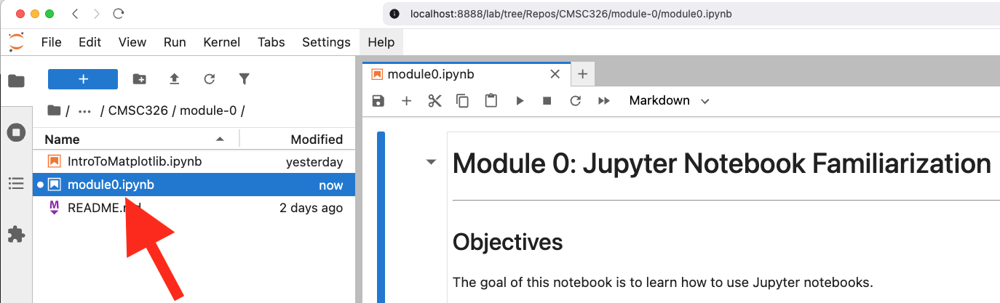
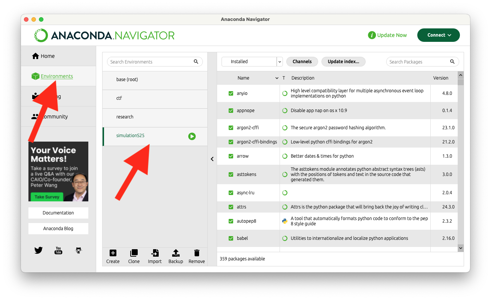
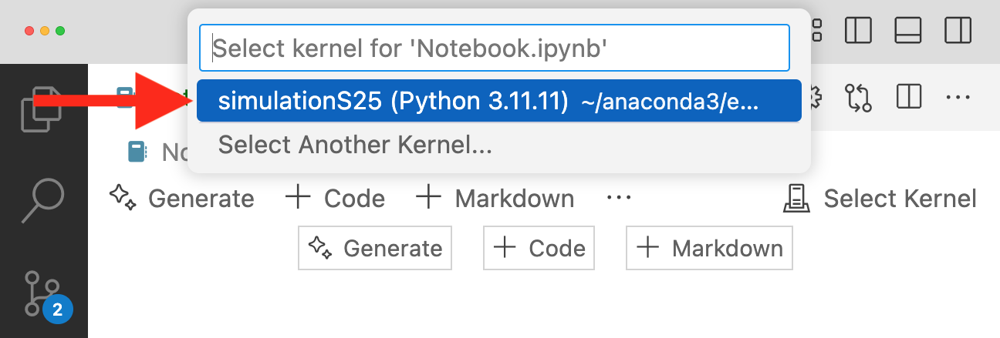
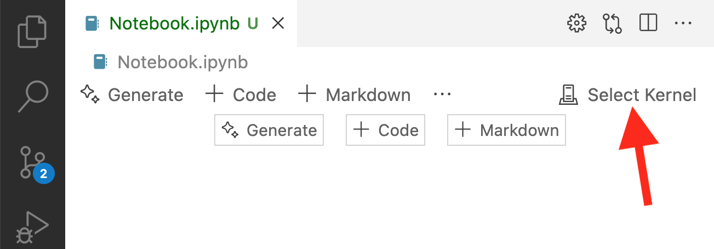

# Setting Up Your Conda Environment

This guide will help you set up a Conda environment with everything you need to run Jupyter Notebooks for the Simulation course. The environment includes essential libraries like Matplotlib, and NumPy.

## Prerequisites

* Install [Anaconda](https://www.anaconda.com/download).
 
 
## Steps to Set Up the Environment

**1.** **Download the Environment File**

Save the following YAML file as `environment.yml` on your computer:

   * Download link here: [environment.yml](https://raw.githubusercontent.com/cmsc326-s25/cmsc326-s25.github.io/refs/heads/main/files/install/environment.yml)

**2.** **Create the Environment**

Open a terminal or command prompt, navigate to the folder where you saved `environment.yml`, and run:

```bash
conda env create -f environment.yml
```

**3.** **Activate the Environment**

After the environment is created, activate it with:

```bash
conda activate simulationS25
```

**4.a** **Launch JupyterLab (Option 1)**

_If you prefer running your notebooks from JupyterLab._ 

Start JupyterLab to test the environment:

```bash
jupyter lab
```
Then navigate to your notebook file and open it.

For example:


**4.b** **Use Anaconda Navigator (Option 2)**

Launch the anaconda navigator.


From the environments tab, select "`simulationS25`" from the dropdown menu.


Click to launch Jupyter Labs


Then navigate to your notebook file and open it.

**4.c** **Use VSCode Notebooks (Option 3)**

_If you prefer running your notebooks from VSCode._ 

Start VSCode and select the kernel.

First open the notebook file below. Then click the "`Select Kernel`" button on the upper right.



Then select "`simulationS25`" from the dropdown menu.


**5.** **Verify the Setup**

Download this notebook and run both cells to test the setup.

   * Download link here: [TestEnvironment.ipynb](https://raw.githubusercontent.com/cmsc326-s25/cmsc326-s25.github.io/refs/heads/main/files/test/TestEnvironment.ipynb)


## Trouble Shooting

Here are some trouble shooting tips:

* **If the py5 GUI did not work**

You may need to install a Java JDK, because the py5 GUIs use Java in the background.

```bash
conda activate simulationS25
pip install install-jdk
python -c "import jdk; print('Java installed to', jdk.install('17'))"
```


## Managing Conda Environments

Here are some general commands to help you manage Conda environments:

1. **List All Environments**
To see all available Conda environments on your system:
```bash
conda env list
```
This will show a list of environments along with their paths.

Example output:

```bash
# conda environments:
#
base                     /path/to/anaconda3
simulationS25         *  /path/to/anaconda3/envs/simulationS25
```

Note: the * signifies the currently active environment.


2. **Activate an Environment**
To activate a specific environment:
```bash
conda activate <environment_name>
```
For example:
```bash
conda activate simulationS25
```

3. **Deactivate the Current Environment**
To deactivate the currently active environment:
```bash
conda deactivate
```

4. **Remove an Environment**
To delete an environment and all its dependencies:
```bash
conda env remove -n <environment_name>
```
For example:
```bash
conda env remove -n simulationS25
```


